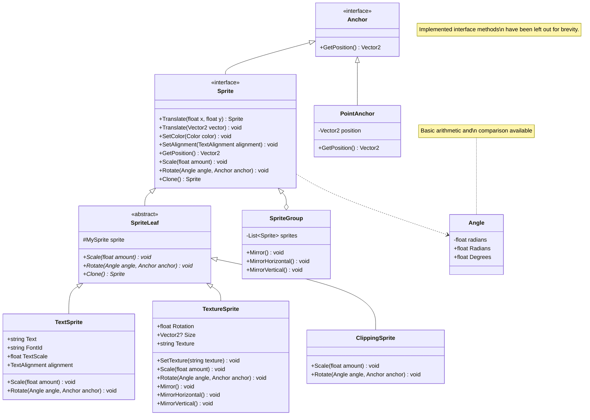

```mermaid
classDiagram
    note "Implemented interface methods\n have been left out for brevity."
    class Sprite {
        <<interface>>
        +Translate(float x, float y) Sprite
        +Translate(Vector2 vector) void
        +SetColor(Color color) void
        +SetAlignment(TextAlignment alignment) void
        +GetPosition() Vector2
        +Scale(float amount) void
        +Rotate(Angle angle, Anchor anchor) void
        +Clone() Sprite
    }

    Anchor <|-- Sprite
    Sprite <|-- SpriteLeaf
    Sprite <|--o SpriteGroup
    Sprite ..> Angle
    
    class SpriteLeaf {
        <<abstract>>
        #MySprite sprite
        +Scale(float amount)* void
        +Rotate(Angle angle, Anchor anchor)* void
        +Clone()* Sprite
    }
    
    SpriteLeaf <|-- TextSprite
    SpriteLeaf <|-- TextureSprite
    SpriteLeaf <|-- ClippingSprite
    
    class TextureSprite {
        +float Rotation
        +Vector2? Size
        +string Texture
        +SetTexture(string texture) void
        +Scale(float amount) void
        +Rotate(Angle angle, Anchor anchor) void
        +Mirror() void
        +MirrorHorizontal() void
        +MirrorVertical() void
    }
    
    class TextSprite {
        +string Text
        +string FontId
        +float TextScale
        +TextAlignment alignment
        +Scale(float amount) void
        +Rotate(Angle angle, Anchor anchor) void
    }
    
    class ClippingSprite {
        +Scale(float amount) void
        +Rotate(Angle angle, Anchor anchor) void
    }
    
    class SpriteGroup {
        -List~Sprite~ sprites
        +Mirror() void
        +MirrorHorizontal() void
        +MirrorVertical() void
    }
    
    class Angle {
        -float radians
        +float Radians
        +float Degrees
    }
    
    note for Angle "Basic arithmetic and\n comparison available"
    
    class Anchor {
        <<interface>>
        +GetPosition() Vector2
    }
    
    class PointAnchor {
        -Vector2 position
        +GetPosition() Vector2
    }
    
    Anchor <|-- PointAnchor
```