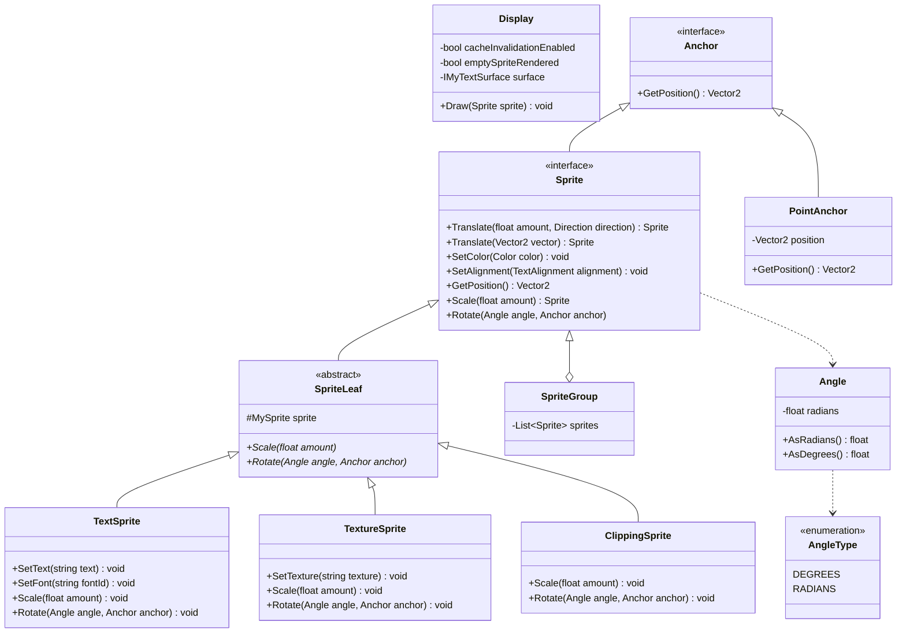

```mermaid
classDiagram
    class Display {
        -bool cacheInvalidationEnabled
        -bool emptySpriteRendered
        -IMyTextSurface surface
        +Draw(Sprite sprite) void
        
    }

    class Sprite {
        <<interface>>
        +Translate(float amount, Direction direction) Sprite
        +Translate(Vector2 vector) Sprite
        +SetColor(Color color) void
        +SetAlignment(TextAlignment alignment) void
        +GetPosition() Vector2
        +Scale(float amount) Sprite
        +Rotate(Angle angle, Anchor anchor)
    }

    Anchor <|-- Sprite
    Sprite <|-- SpriteLeaf
    Sprite <|--o SpriteGroup
    Sprite ..> Angle
    Angle .. > AngleType
    
    class SpriteLeaf {
        <<abstract>>
        #MySprite sprite
        +Scale(float amount)*
        +Rotate(Angle angle, Anchor anchor)*
    }
    
    SpriteLeaf <|-- TextSprite
    SpriteLeaf <|-- TextureSprite
    SpriteLeaf <|-- ClippingSprite
    
    class TextureSprite {
        +SetTexture(string texture) void
        +Scale(float amount) void
        +Rotate(Angle angle, Anchor anchor) void
    }
    
    class TextSprite {
        +SetText(string text) void
        +SetFont(string fontId) void
        +Scale(float amount) void
        +Rotate(Angle angle, Anchor anchor) void
    }
    
    class ClippingSprite {
        +Scale(float amount) void
        +Rotate(Angle angle, Anchor anchor) void
    }
    
    class SpriteGroup {
        -List~Sprite~ sprites
    }
    
    class Angle {
        -float radians
        +AsRadians() float
        +AsDegrees() float
    }
    
    class AngleType {
        <<enumeration>>
        DEGREES
        RADIANS
    }
    
    class Anchor {
        <<interface>>
        +GetPosition() Vector2
    }
    
    class PointAnchor {
        -Vector2 position
        +GetPosition() Vector2
    }
    
    Anchor <|-- PointAnchor
```